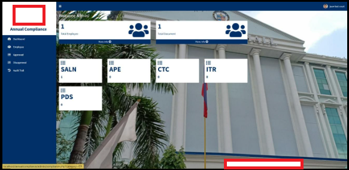
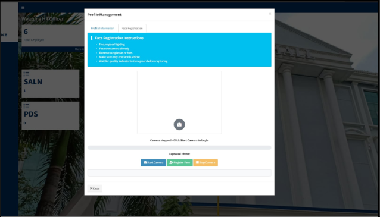
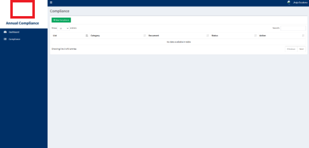

# Compliance System

## 📌 Overview
Employee compliance submission system with integrated CNN face recognition for faster authentication. Supports multiple user roles with different permissions and actions.

---

## ✨ Features
- Compliance submission for employees
- Integrated face recognition authentication
- Multi-role access (HR Staff, HR Officer, Admin, Employee)
- Role-based permissions and actions

---

## 🖼️ Screenshots

  
  
   
  
  

---

## 🛠️ Tech Stack
| Component | Technology |
|-----------|------------|
| Backend | PHP, Python Flask |
| Database | MariaDB Xampp |
| Face Recognition | DeepFace |
| Server | XAMPP (Apache) |
| Authentication | CNN-based face recognition |

---

> **Note:** This repository intentionally excludes setup instructions and sensitive configuration details due to confidentiality requirements.